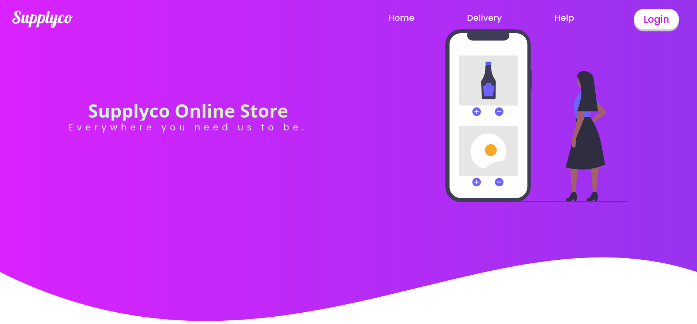
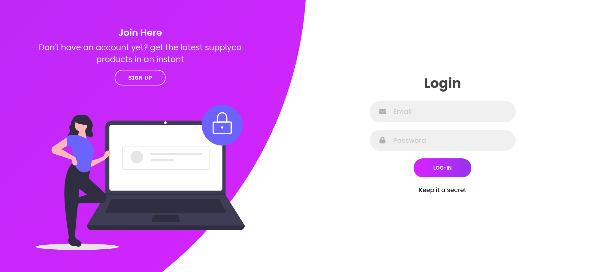
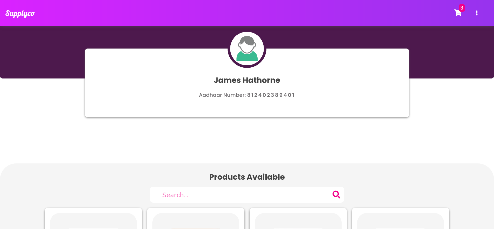
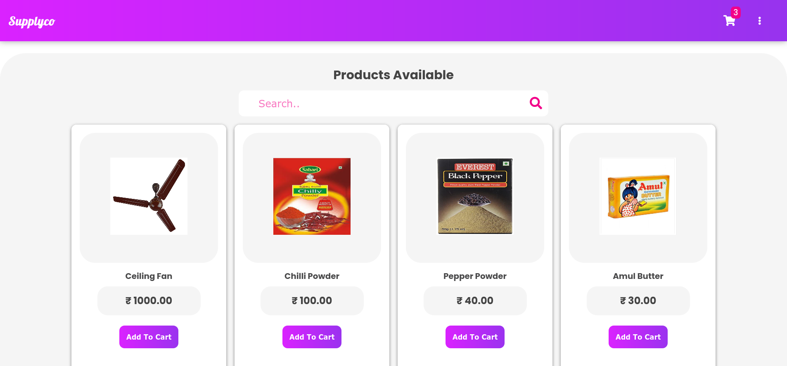
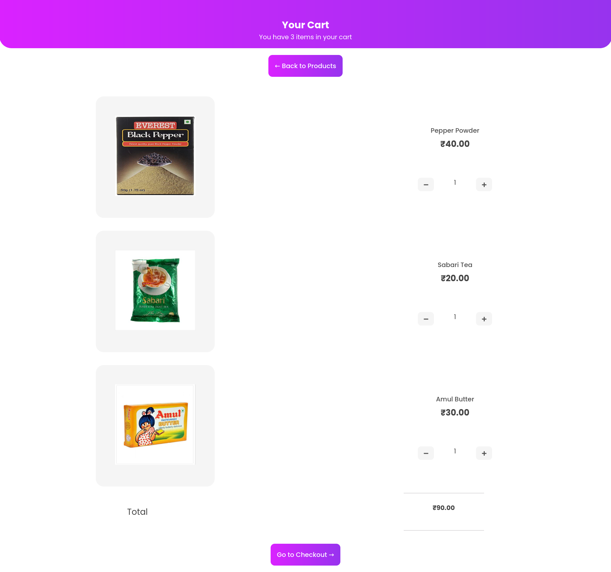
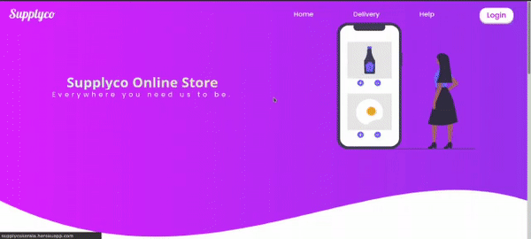
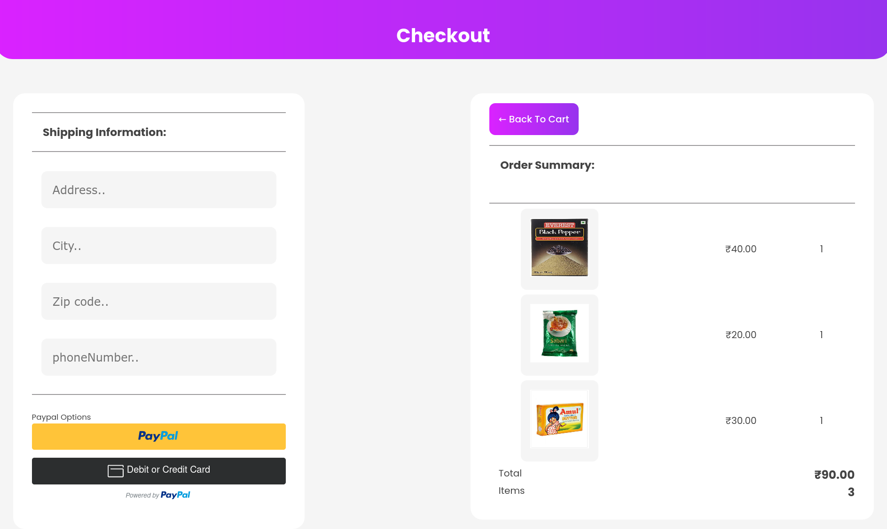

# supplycokerala

an online platform that allows the government owned companies to provide commodities to the  kerala community at the time of covid 19 crisis.

.The app allows user to create an account with the aadhar card provided by the government.
.User friendly webpage with responsive and aesthetic design.
.Also provides delivery page for staff to maintain order.
.Admin page which can be used to manage delivery staff,customers and products available.

  ## Login page
  
  ## products page
  
  

## Technology

The application is built with:

- Python version 3.9.2
- Django version 3.1.3
- Html5 and Css3
- Javascript
- Jquery
- Sqlite3 (database)
- Git (version control)
- AWS S3(cloud storage)
  
  ## Cart page
  
  
  ## Demo
  
    ### Main page
    
    
    [supplycokerala](http://supplycokerala.herokuapp.com/)

  
## **NOTE :**
This is site is a demonstration of my work (an eCommerce Site) & is not ready to shop online right now.
It is made for purpose of mini project in my college.
some of services like site analytics, traffic tracking, api services are added later (On Demand).

## Checkout page

