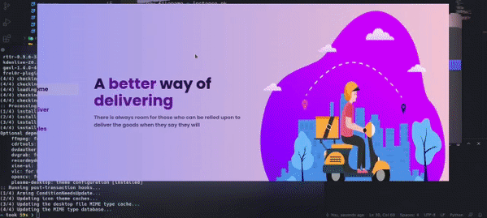

# supplycokerala


## Link for the demo
### [SupplycoKerala](http://supplycokerala.herokuapp.com/)

an online platform that allows the government owned companies to provide commodities to the  kerala community at the time of covid 19 crisis.


## Key Features

.The app allows user to create an account with the aadhar card provided by the government.
.User friendly webpage with responsive and aesthetic design.
.Also provides delivery page for staff to maintain order.
.Admin page which can be used to manage delivery staff,customers and products available.


## Demo

  ### Main page
   [store-page](gif1.gif)
   
## How To Use 
   To clone  and run this application you will need [Git](https://git-scm.com/) ,[Python](https://www.python.org/downloads/) and [Pip](https://pypi.org/project/pip/) installed on your computer.Use the command line to run:
   
```bash
#Clone this repo
$ git clone https://github.com/NiranjRajesh/Supplyco-web-app.git

#Cd into the repo
$ cd Supplyco-web-app

#Optional install venv (to setup a virtual environment)
$ python3 -m pip install --user virtualenv

#Create the virtual environment( replace env with desired name) a new folder will be created
$ python3 -m venv env

#Activate the virtual environment
$ source env/bin/activate

#Install the dependencies
$ pip install -r requirements.txt

#Start the Development Server
$ python manage.py runserver

```


## Technology

The application is built with:

- Python version 3.9.2
- Django version 3.1.3
- Html5 and Css3
- Javascript
- Jquery
- Sqlite3 (database)
- Git (version control)
- AWS S3(cloud storage)
  


    
    ### Delivery page
    


  
## **NOTE FROM THE  AUTHOR:**
This is site is a demonstration of my work (an eCommerce Site) & is not ready to shop online right now.
It is made for purpose of mini project in my college.
As it was a learning experience for my path towards web development... 
Some of services like site analytics, traffic tracking, api services are not added.


